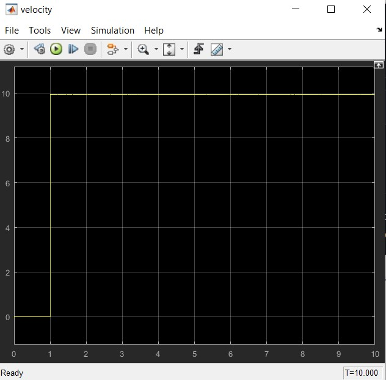

# MATLAB

This is a Tuning of DC motor using PD controller. The proportional and derivative parameters of the controller are adjusted. The velocity of the dc motor is a feedback to the circuit. So that the motor's rpm is controlled and ended up running at the desired speed.

# The Response of motor for 10v input is

